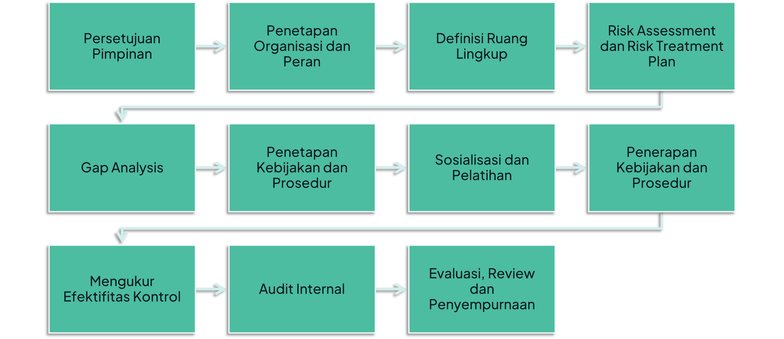

# Sistem Manajemen Keamanan Informasi (SMKI)

**SMKI** merupakan suatu proses yang disusun berdasarkan pendekatan berbasis risiko untuk merencanakan (**Plan**), mengimplementasikan dan mengoperasikan (**Do**), memonitor dan meninjau ulang (**Check**) serta memelihara dan meningkatkan (**Act**) keamanan informasi organisasi. *~SNI ISO/IEC 27001:2022*

## Tujuan Penerapan SMKI

Untuk menjaga:
- **Konfidensialitas** (*Confidentiality*), menjamin bahwa hanya mereka yang memiliki hak yang dapat mengakses informasi tertentu.
- **Integritas** (*Integrity*), menjamin kelengkapan informasi dan menjaga kerusakan atau ancaman yang mengakibatkan berubah informasi dari aslinya.
- **Availabilitas** (*Availability*), pengguna yang berwenang memiliki akses ke informasi tanpa adanya gangguan/hambatan.

## Dasar Hukum Penerapan SMKI

- **UU 19/2016**: *Pasal 15 ayat (1)*, "setiap PSE harus menyelenggarakan SE secara **andal dan aman** serta bertanggung jawab terhadap operasinya SE sebagaimana mestinya."
- **Perpres 95/2018**: *Pasal 48 ayat (1)*, "Manajemen keamanan informasi bertujuan untuk **menjamin keberlangsungan SPBE** dengan **meminimalkan dampak risiko keamanan informasi**."
- **PP 71/2019**: *Pasal 4, 6, 12, dan 13*, memuat ketentuan yang harus dipenuhi sebagai Penyelenggara Sistem Elektronik (PSE).
- **Peraturan BSSN 8/2020**: Sistem Pengamanan dalam Penyelenggaraan Sistem Elektronik.
- **Peraturan BSSN 8/2021 dan 9/2021**: Penyelenggaraan Penilaian Kesiapan Penerapan SNI ISO/IEC 27001 menggunakan Indeks Keamanan Informasi.

## Manfaat Penerapan SMKI

- Mengurangi kerugian finansial
- Mengurangi insiden Kaminfo
- Pengelolaan Risiko yg Efektif
- Memberikan keyakinan pengguna
- Melindungi reputasi
- Keunggulan saat tender (bagi organisasi yang *profit oriented*)
- dsb.

## Alur Penerapan SMKI

## Konsultan SMKI

### Lembaga Konsultan dan Sertifikasi SMKI

Organisasi dapat melakukan akselerasi dan pendampingan implementasi SMKI, serta Sertifikasi SMKI (SNI ISO/IEC 27001) dengan menggunakan [Lembaga Konsultan dan Lembaga Sertifikasi SMKI](https://www.bssn.go.id/daftar-lembaga-konsultan-dan-lembaga-sertifikasi/) yang telah diskrining oleh Badan Siber dan Sandi Negara (BSSN), hal ini dapat menjadi pertimbangan organisasi Anda dalam memilih jasa konsultan SMKI.

### Auditor Keamanan Informasi dan Implementor SMKI

Selain mengeluarkan [Daftar Putih Lembaga Konsultan dan Lembaga Sertifikasi SMKI](https://www.bssn.go.id/daftar-lembaga-konsultan-dan-lembaga-sertifikasi/), BSSN juga mengeluarkan [Daftar Auditor Keamanan Informasi dan Implementor SMPI](https://www.bssn.go.id/daftar-auditor-keamanan-informasi-dan-implementor-smpi/) yang dapat sebagai pertimbangan dalam memilih jasa auditor keamanan informasi dan implementor SMPI.